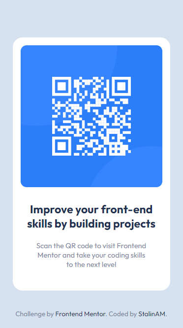

# QrCodeComponent
Challenge of FrontEndMentor with HTML-CSS
# Frontend Mentor - QR code component solution

This is a solution to the [QR code component challenge on Frontend Mentor](https://www.frontendmentor.io/challenges/qr-code-component-iux_sIO_H). Frontend Mentor challenges help you improve your coding skills by building realistic projects. 
## Table of contents

- [QrCodeComponent](#qrcodecomponent)
- [Frontend Mentor - QR code component solution](#frontend-mentor---qr-code-component-solution)
  - [Table of contents](#table-of-contents)
    - [Screenshot](#screenshot)
    - [Links](#links)
  - [My process](#my-process)
    - [Built with](#built-with)
    - [What I learned](#what-i-learned)
    - [Useful resources](#useful-resources)
  - [Author](#author)

### Screenshot



### Links

- Solution URL: [GitHub](https://github.com/StalinAM/QrCodeComponent.git)
- Live Site URL: [StalinAM](https://stalinam.github.io/QrCodeComponent/)

## My process

### Built with

- Semantic HTML5 markup
- CSS custom properties
- CSS Grid
- Mobile-first workflow
- Responsive web design

### What I learned

Personally, the easiest and most intuitive way to split the body is through the CSS grid layout module.

```html
<body>
    <main></main>
    <footer></footer>
</body>
```
```css
body {
    /* toma el alto de la pantalla */
    height: 100vh;
    /* CSS GRID */
    display: grid;
    place-items: center;
    /* crea dos espacios con medida de auto y 65px */
    grid-template-rows: auto 65px;
}
```

To make the page responsive I define the font size in percentage and vary the font size value with rem, this way it doesn't depend on the parent element but on the root element of the html.

```css
html {
    font-size: 65.5%;
}
.image-description {
    font-size: 1.4rem;
}
footer {
    font-size: 1.3rem;
}
```
### Useful resources

- [CSS Grid Layout Module](https://www.w3schools.com/css/css_grid.asp) - This helped me to divide the body better.

## Author

- GitHub - [StalinAM](https://github.com/StalinAM)
- Frontend Mentor - [@StalinAM](https://www.frontendmentor.io/profile/StalinAM)